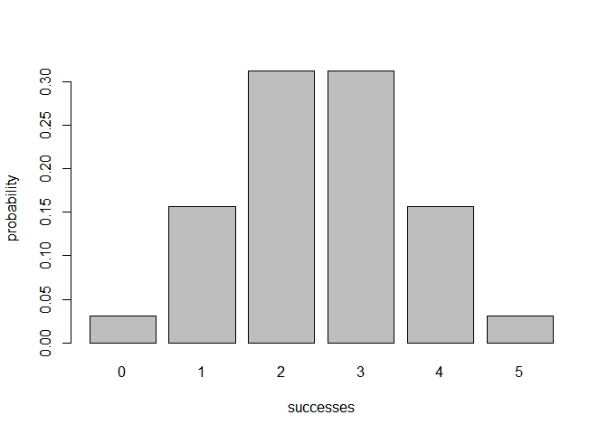
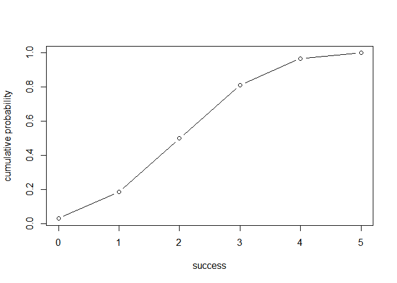

<!-- README.md is generated from README.Rmd. Please edit that file -->
Overview
--------

`"binomial"` is an [R](http://www.r-project.org/) pacakge that providess functions for calculating probabilities of a binomial random variable, and related calcualtions such as the probability distribution, the expected value, variance, etc.

Motivation
----------

This package had been developed to help the author get in touched with building R packages and provide tools for calculating probabilties of binomial random variables.

Installation
------------

You can install the released version of binomial from [CRAN](https://CRAN.R-project.org) with:

``` r
install.packages("binomial")
```

And the development version from [GitHub](https://github.com/) with:

``` r
# install.packages("devtools")
devtools::install_github("stat133-sp19/hw-stat133-mingyueyang")
```

Usage
-----

``` r
library(binomial)
## some examples
# binomial probability of getting 2 successes in 5 trials,assuming prob of success = 0.5
bin_probability(success = 2, trials = 5, prob = 0.5)
#> [1] 0.3125

# binomial probability distribution of getting possible successes in 5 trials,assuming prob of success = 0.5
bin_distribution(trials = 5, prob = 0.5)
#>   success probability
#> 1       0     0.03125
#> 2       1     0.15625
#> 3       2     0.31250
#> 4       3     0.31250
#> 5       4     0.15625
#> 6       5     0.03125

# plotting binomial probability distribution
dis1 <- bin_distribution(trials = 5, prob = 0.5)
plot(dis1)
```



``` r

# binomial cumulative distribution  of getting possible successes in 5 trials,assuming prob of success = 0.5
bin_cumulative(trials = 5, prob = 0.5)
#>   success probability cumulative
#> 1       0     0.03125    0.03125
#> 2       1     0.15625    0.18750
#> 3       2     0.31250    0.50000
#> 4       3     0.31250    0.81250
#> 5       4     0.15625    0.96875
#> 6       5     0.03125    1.00000

# plotting binomial cumulative distribution
dis2 <- bin_cumulative(trials = 5, prob = 0.5)
plot(dis2)
```



``` r

# binomial variable
bin1 <- bin_variable(trials = 10, p = 0.3)
bin1
#> "Binomial variable" 
#> 
#> Parameters 
#> - number of trials: 10 
#> - prob of success: 0.3

# summary of a binomial variable
bin1 <- bin_variable(trials = 10, p = 0.3)
binsum1 <- summary(bin1)
binsum1
#> "Summary Binomial" 
#> 
#> Parameters 
#> - number of trials: 10 
#> - prob of success: 0.3
#> 
#> Measures 
#> - mean: 3 
#> - variance: 2.1 
#> - mode: 3 
#> - skewness: 0.2760262 
#> - kurtosis: -0.1238095

# functions of measures
bin_variance(10, 0.3)
#> [1] 2.1
bin_mode(10, 0.3)
#> [1] 3
bin_skewness(10, 0.3)
#> [1] 0.2760262
bin_kurtosis(10, 0.3)
#> [1] -0.1238095
```
