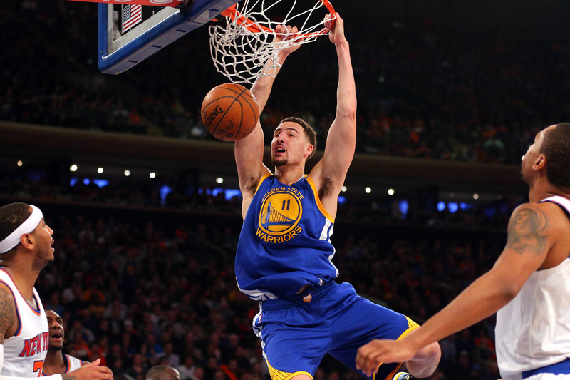
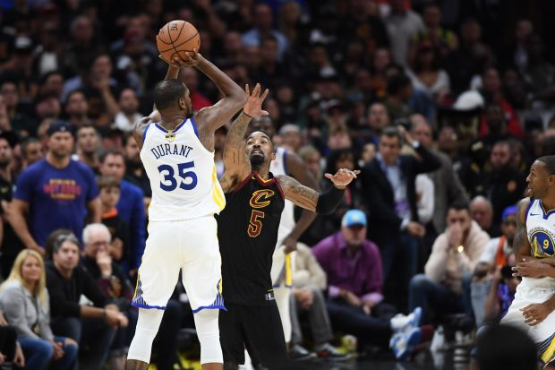
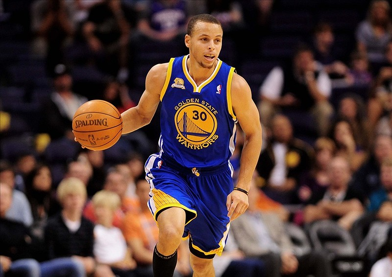
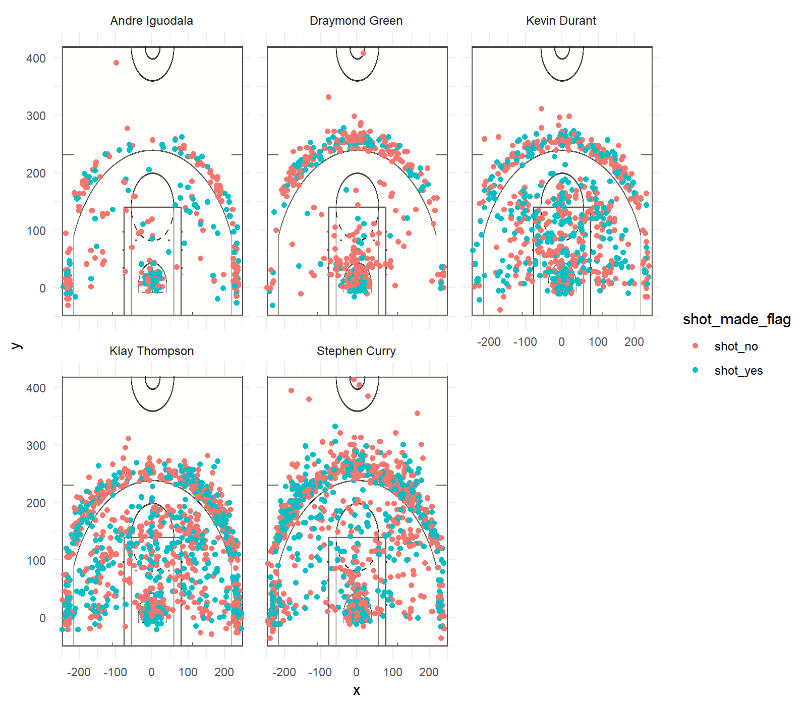
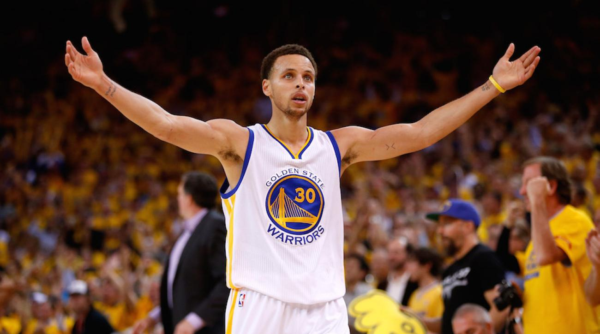
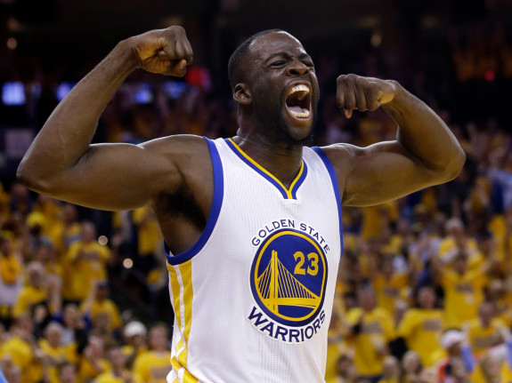

Workout 1
================
Mingyue Yang

**Warriors Can Shoot!**
-----------------------

### **Introduction**

Who is the most popular NBA team in California? The Golden State Warriors!

This legendary team, after going through ups and downs throughout its history, has created a new NBA dynasty today.  You might cheer and scream for each shot the Warriors have made before, but do you know what their strengths and weakness are, or how effective their shooting is? If not, this article will tell you.

### **Motivation**

According to Forbes’ list of Most Valuable Sports Teams, The Golden State Warriors are the tenth highest valued sports franchise in the world, with an estimated value of approximately $3.1 billion.


As the Wikipedia stated,

> “The Warriors' fortunes changed in the 2010s, ushering in a new era of success led by Stephen Curry. After drafting perennial All-Stars Klay Thompson and Draymond Green, the team returned to championship glory in 2015, before winning another two in 2017 and 2018 with the help of former league MVP Kevin Durant.”

John Schuhmann, a professional journalist for NBA.com, commented that,

> "They're on pace to be just the fourth team in the last 20 years to make more than half their shots. And when you factor in the value of 3-pointers, their shots are more valuable than any of the 1,483 other teams that have played in this league. "

Every shot is money! But how effective is their shooting?



### **Data and Analysis**

Now let’s see effective shooting data of five gorgeous Warriors, including Stephen Curry, Kevin Durant, Klay Thompson, Draymond Green, and Andre Iguodala.

    ## 
    ## Attaching package: 'dplyr'

    ## The following objects are masked from 'package:stats':
    ## 
    ##     filter, lag

    ## The following objects are masked from 'package:base':
    ## 
    ##     intersect, setdiff, setequal, union

**2PT Effective Shooting % by Player: 2 PT Field Goal effective shooting percentage by player, arranged in descending order by percentage.**

``` r
dat <- read.csv("../data/shots-data.csv", header = TRUE)
two_point <- filter(dat,shot_type == "2PT Field Goal")
two_point <- select(two_point, name, shot_made_flag)

two_point$shots_y <- two_point$shot_made_flag == "shot_yes"
two_point$total <- two_point$shot_made_flag == "shot_yes"|two_point$shot_made_flag=="shot_no"

table2 <- two_point %>% group_by(name) %>% summarise(total_shots = sum(total),made_shots=sum(shots_y), perc_made = (made_shots/total_shots)*100) %>% arrange(desc(perc_made))
table2
```

    ## # A tibble: 5 x 4
    ##   name           total_shots made_shots perc_made
    ##   <fct>                <int>      <int>     <dbl>
    ## 1 Andre Iguodala         210        134      63.8
    ## 2 Kevin Durant           643        390      60.7
    ## 3 Stephen Curry          563        304      54.0
    ## 4 Klay Thompson          640        329      51.4
    ## 5 Draymond Green         346        171      49.4

From the above table, we can see that Kevin Durant and Klay Thompson have the most number of the 2PT shots, both exceeding 600. Stephen curry, follows behind with a number of 463 total 2PT shots. Andre Iguodala, who makes the least number shots, actually has the highst effective shooting of 2PT field goal. Almost all of them have a effective shooting rate higher than 50%, which means the Warriors can make more than half of their shots! This is an astonishing number.


**3PT Effective Shooting % by Player: 3 PT Field Goal effective shooting percentage by player, arranged in descending order by percentage**

``` r
three_point <- filter(dat,shot_type == "3PT Field Goal")
three_point <- select(three_point, name, shot_made_flag)

three_point$shots_y <- three_point$shot_made_flag == "shot_yes"
three_point$total <- three_point$shot_made_flag == "shot_yes"|three_point$shot_made_flag=="shot_no"

table3 <- three_point %>% group_by(name) %>% summarise(total_shots = sum(total),made_shots=sum(shots_y), perc_made = (made_shots/total_shots)*100) %>% arrange(desc(perc_made))
table3
```

    ## # A tibble: 5 x 4
    ##   name           total_shots made_shots perc_made
    ##   <fct>                <int>      <int>     <dbl>
    ## 1 Klay Thompson          580        246      42.4
    ## 2 Stephen Curry          687        280      40.8
    ## 3 Kevin Durant           272        105      38.6
    ## 4 Andre Iguodala         161         58      36.0
    ## 5 Draymond Green         232         74      31.9

Stephen Curry is well known for his wonderful skill of 3PT shooting. From the table, we can tell that Curry has the highest number of total 3PT shots, which exceeds 650! Curry's hit rate is also really high,approximately 40.8%. Klay Thompson has made 580 shots and has the highest effective shooting rate of 3PT field goal among the selected five stars.Kevin Durant, Andre Iguodala, and Draymond Green are less outstanding in 3PT shooting than Curry and Thompson, but still with an effective shooting rate higher than 30% respectively.



**Effective Shooting % by Player: Overall (i.e. including 2PT and 3PT Field Goals) effective shooting percentage by player, arranged in descending order by percentage**

``` r
all_point <- select(dat, name, shot_made_flag)

all_point$shots_y <- all_point$shot_made_flag == "shot_yes"
all_point$total <- all_point$shot_made_flag == "shot_yes"|all_point$shot_made_flag=="shot_no"

table <- all_point %>% group_by(name) %>% summarise(total_shots = sum(total),made_shots=sum(shots_y), perc_made = (made_shots/total_shots)*100) %>% arrange(desc(perc_made))
table
```

    ## # A tibble: 5 x 4
    ##   name           total_shots made_shots perc_made
    ##   <fct>                <int>      <int>     <dbl>
    ## 1 Kevin Durant           915        495      54.1
    ## 2 Andre Iguodala         371        192      51.8
    ## 3 Klay Thompson         1220        575      47.1
    ## 4 Stephen Curry         1250        584      46.7
    ## 5 Draymond Green         578        245      42.4

Here, Stephen Curry again takes the highest place, with a total of 1250 shots. Klay Thompson has made a total of 1220 shots with approximately 47.1% effective shooting rate, which is about 0.5% higher than Stephen Curry. Kevin Durant hasn't made 1000 shots at this point, but he has the highest effectiv shooting rate, which is 54.1%! An effective rate of 54.1% means that Kevin Durant can make more than half of his total shots, which is amazing. Draymond Green and Andre Iguodala have less total shots but their effectice shooting rate is 42.4% and 51.8% respectively.


Now let's take a look at the shots charts for Andre Iguodala, Draymond Green, Kevin Durant, Klay Thompson, and Stephen Curry respectively. From the shots chart, we can visualize the spots on the basketball court where each Warriors has made or lost shots.  We know that Stephen Curry has the highest number of total shots from the previous table. Here, we can see that the shots chart for Stephen Curry has the highest number of points. There is also a noticeable green arc along 3PT line, which corresponds to the fact that he has made the higest number of 3PT shots. Many people called him the greatest shooter in NBA history. His excellent shootng skill has won him six-time NBA All-Star, two-time Most Valuable Player(MVP), and three NBA championship with the Warriors. He is also credited with revolutionizing the basketball game by employing 3PT shots as part of winning strategy. 

Kevin Durant, according to the shots chart, is more excellent inside the 3PT line, especially near the rim. He joined the Golden State Warriors in 2016. "He chose an ideal roster fit and a shot at playing for the highest-scoring offense the NBA has seen in decades. He chose life alongside Stephen Curry and Klay Thompson, the greatest shooting backcourt in history, and he chose to go against Andre Iguodala and Draymond Green, two elite defenders, in practices rather than in Western Conference finals games." commented by Ben Golliver on his move.

Klay Thompson, who has the second highest number of total shots, seems to be able to successfully shoot from anywhere. He is a key contributor in the Warriors. According to Wikipedia, in 2014, Thompson and teammate Stephen Curry set a then NBA record with 484 combined three-pointers in a season, earning the pair the nickname the "Splash Brothers". 

While Andre and Draymond are not as impressive when it comes to long-distance shots as the previous three players, they are both elite defenders and play a key role in the Warriors team.

### **Key Takeaway**

Basketball is a team game. There is no need for one single person to be perfect 2PT shot maker and 3PT shot maker at the same time. Klay Thompson and Stephen Curry are good at 3PT shooting, so they should further improve their 3PT shooting skills. Kevin Durant, who has the highest effective shooting rate and does well in both 2PT and 3PT goal field, can be more flexible and get the most out of his strengths cooperating with other teammates. Draymond Green and Andre Iguodala don't have as many as shots as Klay Thompson or Stephen Curry, but they are still an important part of the team and can help their teammates shoot better. **Go Warriors!**

### **Reference**

-   [One Team, One Shot](https://www.nba.com/article/2017/12/14/one-team-one-stat-warriors-shooting-better-ever)
-   [The Warriors](https://www.nba.com/warriors/)
-   [Golden State Warriors](https://en.wikipedia.org/wiki/Golden_State_Warriors)

<font size="2"> Note: all data is from 2016-2017 season.
